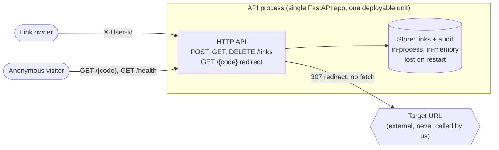

# High-level design

One view of this system at container level: what runs, what holds state, what it talks to across a
trust boundary. The design stage amends it — `.sdlc/flow.yaml` names this path under
`stages.design.diagram`, and G6 in `.sdlc/standards/engineering-guardrails.md` binds a change to it.

Two rules keep it worth reading:

- **One box per deployable unit, datastore, external service or boundary.** Component-level detail
  belongs in the spec that introduces it. Detail here goes stale unread, and a stale diagram is
  worse than none.
- **Text, never an image.** An amendment has to be a diff a reviewer can read, and a drawing tool's
  export is not one.

Two things the diagram is making a point of:

- **The store is inside the process.** There is no database container and no network hop. Every
  spec that needs durability across a restart is an architectural change.
- **The target URL is not an external dependency.** The app redirects the browser; it never fetches
  the target itself. A change that makes the app call out is a new trust boundary.

The authenticated surface is the `X-User-Id` header. `GET /health` and `GET /{code}` are anonymous
by design — see `.sdlc/standards/` and the audit rule for why the follow path keeps no identity.

## What moved, and when

| Date | What changed | Spec |
|---|---|---|
| 2026-10-09 | First drawn: one process, in-memory store, no external calls. | — |
